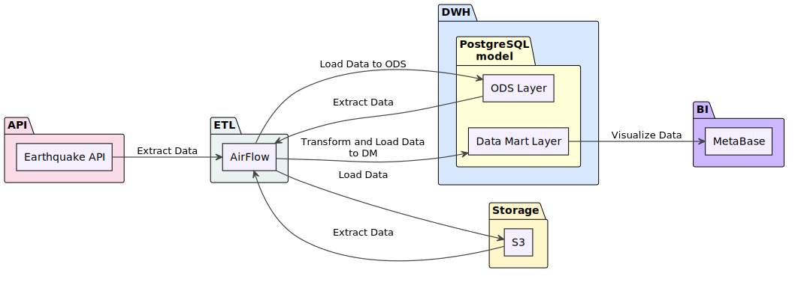
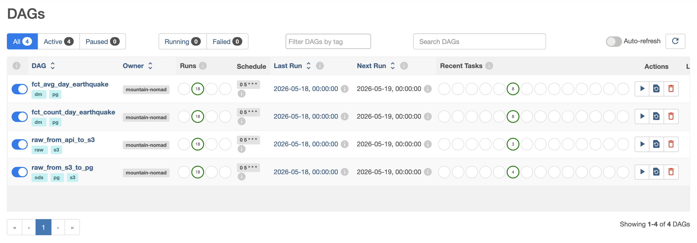

# 🌍 Earthquake Data Engineering Pipeline

An end-to-end data engineering project that ingests real-time earthquake data from the [USGS Earthquake API](https://earthquake.usgs.gov/fdsnws/event/1/), processes it through a multi-layered data warehouse, and visualizes key seismic metrics on a BI dashboard — all orchestrated with Apache Airflow and fully containerized via Docker Compose.

---

## 📐 Architecture

<p align="center">
  
</p>

The pipeline follows a classic **ELT** pattern with clearly separated layers:

| Layer | Purpose | Technology |
|-------|---------|------------|
| **API** | External data source — USGS earthquake feed | USGS FDSN Web Service |
| **Storage** | Raw data landing zone (data lake) | MinIO (S3-compatible) |
| **ETL / Orchestration** | Workflow scheduling & execution | Apache Airflow (CeleryExecutor) |
| **DWH — ODS** | Operational Data Store (cleaned raw events) | PostgreSQL |
| **DWH — Data Mart** | Aggregated analytical tables | PostgreSQL |
| **BI** | Dashboards & KPI visualization | Metabase |

**Data Flow:**

```
USGS API  ──►  MinIO (S3)  ──►  PostgreSQL ODS  ──►  PostgreSQL Data Mart  ──►  Metabase
            (Parquet)         (fct_earthquake)     (fct_avg / fct_count)       (Dashboard)
```

---

## ⚙️ Tech Stack

| Component | Technology | Version |
|-----------|-----------|---------|
| Orchestration | Apache Airflow | 2.10.5 |
| Data Processing | DuckDB | 1.2.2 |
| Data Lake | MinIO | RELEASE.2025-02-18 |
| Data Warehouse | PostgreSQL | 13 |
| BI / Visualization | Metabase | 0.52.13 |
| Task Queue | Redis | 7.2 |
| Containerization | Docker Compose | — |

---

## 🔄 Airflow DAGs

The project contains **4 DAGs** that run daily on a `0 5 * * *` (05:00 UTC) schedule with full backfill support:

<p align="center">
  
</p>

### 1. `raw_from_api_to_s3`
> **Tags:** `raw`, `s3`

Extracts daily earthquake data from the USGS FDSN Web Service API and stores it as compressed Parquet files in MinIO (S3).

```
start ➜ get_and_transfer_api_data_to_s3 ➜ end
```

- Uses DuckDB's `httpfs` extension to read CSV directly from the API
- Writes to `s3://prod/raw/earthquake/{date}/{date}_00-00-00.gz.parquet`

### 2. `raw_from_s3_to_pg`
> **Tags:** `s3`, `ods`, `pg`

Reads raw Parquet files from MinIO and loads them into the `ods.fct_earthquake` table in the PostgreSQL data warehouse.

```
start ➜ sensor_on_raw_layer ➜ get_and_transfer_raw_data_to_ods_pg ➜ end
```

- Uses an **ExternalTaskSensor** — waits for `raw_from_api_to_s3` to succeed before proceeding
- DuckDB attaches to PostgreSQL directly via the `postgres` extension

### 3. `fct_avg_day_earthquake`
> **Tags:** `dm`, `pg`

Computes the **daily average magnitude** from the ODS layer and upserts results into `dm.fct_avg_day_earthquake`.

```
start ➜ sensor ➜ drop_stg_before ➜ create_stg ➜ delete_from_target ➜ insert_into_target ➜ drop_stg_after ➜ end
```

### 4. `fct_count_day_earthquake`
> **Tags:** `dm`, `pg`

Computes the **daily earthquake count** from the ODS layer and upserts results into `dm.fct_count_day_earthquake`.

```
start ➜ sensor ➜ drop_stg_before ➜ create_stg ➜ delete_from_target ➜ insert_into_target ➜ drop_stg_after ➜ end
```

> Both Data Mart DAGs use the **staging pattern**: create a temp table in `stg`, delete matching rows in the target, insert fresh data, then clean up — ensuring idempotent and re-runnable loads.

---

## 🏗️ Data Warehouse Schema

The DWH uses a **3-schema model** inside PostgreSQL:

```sql
-- Schemas
stg   -- Staging: temporary tables for idempotent loads
ods   -- Operational Data Store: cleaned raw events
dm    -- Data Mart: aggregated analytical tables
```

### `ods.fct_earthquake`

| Column | Type | Description |
|--------|------|-------------|
| `time` | `TIMESTAMPTZ` | Event timestamp |
| `latitude` | `DOUBLE PRECISION` | Latitude |
| `longitude` | `DOUBLE PRECISION` | Longitude |
| `depth` | `DOUBLE PRECISION` | Depth in km |
| `mag` | `DOUBLE PRECISION` | Magnitude |
| `mag_type` | `VARCHAR` | Magnitude type (e.g. ml, md) |
| `place` | `VARCHAR` | Human-readable location |
| `type` | `VARCHAR` | Event type (earthquake, etc.) |
| `status` | `VARCHAR` | Review status |
| ... | ... | *+ 12 more columns (see `DWH_INITIALIZATION.sql`)* |

### `dm.fct_count_day_earthquake`

| Column | Type |
|--------|------|
| `date` | `DATE` |
| `count` | `BIGINT` |

### `dm.fct_avg_day_earthquake`

| Column | Type |
|--------|------|
| `date` | `DATE` |
| `avg` | `DOUBLE PRECISION` |

---

## 📊 Metabase Dashboard

<p align="center">
  
</p>

The Metabase dashboard displays key earthquake KPIs:

- **Day-by-day overview table** — earthquake count, average magnitude, max magnitude, average depth, and strong earthquake count per day
- **Average daily magnitude line graph** — trend of mean magnitude over time
- **Daily earthquake count bar chart** — volume of seismic events per day

Metabase connects directly to the PostgreSQL Data Mart layer and is served with the [DuckDB Metabase driver](https://github.com/MotherDuck-Open-Source/metabase_duckdb_driver) for additional flexibility.

---

## 🚀 Getting Started

### Prerequisites

- **Docker** & **Docker Compose** installed
- At least **4 GB RAM** and **2 CPUs** allocated to Docker
- MinIO credentials configured (see `.env`)

### 1. Clone the repository

```bash
git clone https://github.com/mountain-nomad/DataEngineering_EarthQuake.git
cd DataEngineering_EarthQuake
```

### 2. Set up environment variables

Create a `.env` file in the project root:

```env
MINIO_ACCESS_KEY=<your_minio_access_key>
MINIO_SECRET_KEY=<your_minio_secret_key>
AIRFLOW_UID=50000
```

### 3. Create a Python virtual environment (optional, for local development)

```bash
python3 -m venv venv
source venv/bin/activate
pip install -r requirements.txt
```

### 4. Launch all services

```bash
docker compose up -d
```

This starts:

| Service | URL |
|---------|-----|
| Airflow Web UI | [http://localhost:8080](http://localhost:8080) |
| MinIO Console | [http://localhost:9001](http://localhost:9001) |
| Metabase | [http://localhost:3000](http://localhost:3000) |
| PostgreSQL DWH | `localhost:5432` |

### 5. Initialize the Data Warehouse

Connect to `postgres_dwh` and run the initialization script:

```bash
docker exec -i <postgres_dwh_container> psql -U postgres -d postgres < DWH_INITIALIZATION.sql
```

### 6. Configure Airflow Variables

In the Airflow Web UI (**Admin → Variables**), add the following:

| Key | Value |
|-----|-------|
| `ACCESS_KEY` | Your MinIO access key |
| `SECRET_KEY` | Your MinIO secret key |
| `pg_password` | `postgres` |

### 7. Configure Airflow Connection

In the Airflow Web UI (**Admin → Connections**), add:

| Field | Value |
|-------|-------|
| Connection Id | `postgres_dwh` |
| Connection Type | Postgres |
| Host | `postgres_dwh` |
| Schema | `postgres` |
| Login | `postgres` |
| Password | `postgres` |
| Port | `5432` |

### 8. Enable the DAGs

Unpause all 4 DAGs in the Airflow UI. They will automatically backfill from **May 1, 2026**.

---

## 📁 Project Structure

```
.
├── dags/
│   ├── raw_from_api_to_s3.py          # Extract API → MinIO (S3)
│   ├── raw_from_s3_to_pg.py           # Load S3 → PostgreSQL ODS
│   ├── fct_avg_day_earthquake.py      # Transform ODS → DM (avg magnitude)
│   └── fct_count_day_earthquake.py    # Transform ODS → DM (event count)
├── config/                            # Airflow config overrides
├── data/                              # MinIO data volume
├── logs/                              # Airflow logs
├── metabase/
│   └── Dockerfile                     # Metabase + DuckDB driver image
├── plugins/                           # Airflow plugins
├── docker-compose.yaml                # Full infrastructure definition
├── DWH_INITIALIZATION.sql             # PostgreSQL schema & table DDL
├── requirements.txt                   # Python dependencies
├── Flow.svg                           # Architecture diagram
├── DAGs.png                           # Airflow DAGs screenshot
├── Dashboard Metabase.png             # Metabase dashboard screenshot
├── .env                               # Environment variables (not in VCS)
└── .gitignore
```

---

## 🔑 Default Credentials

| Service | Username | Password |
|---------|----------|----------|
| Airflow | `airflow` | `airflow` |
| PostgreSQL (Airflow) | `airflow` | `airflow` |
| PostgreSQL (DWH) | `postgres` | `postgres` |
| MinIO | `minioadmin` | `minioadmin` |

> ⚠️ **These are development credentials only.** Do not use in production.
